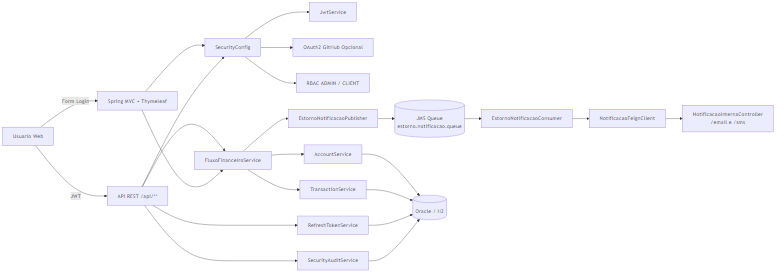
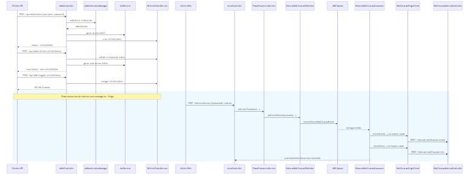
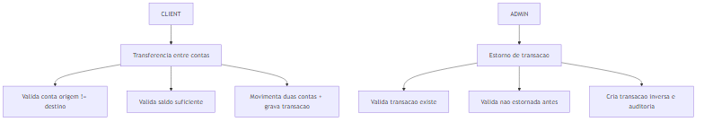

# Midas API - Sistema de Gestão Financeira

API REST desenvolvida em Java com Spring Boot para gestão financeira pessoal, atendendo aos requisitos da Sprint Java Advanced da FIAP.

**🔗 Repositório GitHub:** [midas-fintech repo](https://github.com/viniruggeri/midas-fintech-java)

## 📋 Descrição do Problema

O sistema resolve o problema de controle financeiro pessoal, permitindo:
- Gerenciar contas bancárias
- Registrar e acompanhar transações financeiras
- Controlar receitas e despesas
- Fornecer dados estruturados para análises e relatórios financeiros

## 👥 Equipe

| Nome | Função | RM        | Responsabilidade no Projeto |
|------|--------|-----------|---------------------------|
| **Vinicius** | Tech Lead / IA Engineer | 560593    | Desenvolvimento Java/Spring Boot, Arquitetura da API, Serviços de IA com RAG |
| **Barbara** | Cloud/QA Engineer | RM 560431 | Cloud Azure, QA/Testes, Compliance, Modelagem e Administração de Database |
| **Yasmin** | Mobile/Backend Developer | RM 560039 | Mobile Development, .NET Development, Integração com API |

## 🏗️ Arquitetura da Aplicação

### Camadas da Aplicação:
```
┌─────────────────┐
│   Controller    │ ← REST Controllers (Nível 3 Richardson, HATEOAS)
├─────────────────┤
│    Service      │ ← Regras de Negócio e Validações
├─────────────────┤
│   Repository    │ ← Acesso a Dados (JPA + Generics)
├─────────────────┤
│    Entity       │ ← Entidades JPA Mapeadas
├─────────────────┤
│   Database      │ ← Oracle (Prod) / H2 (Dev)
└─────────────────┘
```

### Padrões de Projeto Utilizados:
- **Repository Pattern** com Generics (JpaRepository<T, ID>)
- **Dependency Injection** (Spring IoC)
- **MVC Pattern** (Model-View-Controller)
- **DTO Pattern** (Data Transfer Objects)

## 🛠️ Tecnologias

- **Java 21** - Linguagem principal
- **Spring Boot 3.2.5** - Framework principal
- **Spring Security** - Autenticação e autorização (ADMIN/CLIENT)
- **OAuth2 Client (GitHub)** - Login social opcional na camada web
- **JWT (jjwt)** - Segurança stateless para endpoints `/api/**`
- **Spring JMS (Artemis embutido)** - Fila para eventos de estorno
- **OpenFeign** - Cliente HTTP para integração de notificação
- **Spring Data JPA** - Persistência de dados e mapeamento objeto-relacional
- **Spring Validation** - Validação funcional com Bean Validation
- **Flyway** - Migrações versionadas de banco de dados
- **Thymeleaf** - Frontend server-side para fluxo web FIAP
- **Spring Boot Actuator** - Endpoints operacionais (health/info/metrics)
- **Lombok** - Redução de boilerplate code
- **H2 Database** - Desenvolvimento
- **Oracle Database** - Produção
- **SpringDoc OpenAPI** - Documentação automática da API
- **Maven** - Gerenciamento de dependências
- **JUnit 5 + Mockito** - Testes unitários e de integração
- **Docker** - Empacotamento e execução em container

## 📊 Diagramas

### Arquitetura Atual (Segurança + Fluxos)
- Arquivo fonte Mermaid: `docs/diagrams/arquitetura-midas.md`

### 1) Visão de Componentes


### 2) Fluxo de Autenticação da API


### 3) Fluxos Funcionais FIAP


### Explicação dos Relacionamentos e Constraints:
- **Account (1) ←→ (N) Transaction**: Uma conta pode ter várias transações
- **Constraints Implementadas**: 
  - Account.saldo deve ser >= 0 (@DecimalMin)
  - Account.nome é obrigatório e não pode ser vazio (@NotBlank)
  - Transaction.valor deve ser > 0 (@DecimalMin)
  - Transaction.tipo é obrigatório (RECEITA/DESPESA)
  - Transaction.data é obrigatória (@NotNull)
  - Account.nome deve ser único (validação no service)

## 🚀 Como Executar a Aplicação

### Pré-requisitos:
- Java 21 ou superior
- Maven wrapper (`mvnw`/`mvnw.cmd`) já incluso no projeto
- Oracle Database (para produção)

### Execução em Desenvolvimento (H2):
```bash
# Clone o repositório
git clone https://github.com/viniruggeri/midas-fintech-java.git
cd midas-fintech-java

# Execute com H2 em memória
.\mvnw.cmd spring-boot:run -Dspring-boot.run.profiles=dev
```

### Execução em Produção (Oracle):
```bash
# Configure as variáveis de ambiente no `.env`
set ORACLE_URL=jdbc:oracle:thin:@//seu_host:1521/seu_servico
set ORACLE_USER=seu_usuario
set ORACLE_PASSWORD=sua_senha
set JWT_SECRET=seu_segredo_com_32_chars_ou_mais
set SECURITY_OAUTH2_GITHUB_ENABLED=true
set SECURITY_OAUTH2_ADMIN_GITHUB_LOGINS=seu_login_github_admin
set GITHUB_OAUTH2_CLIENT_ID=seu_client_id
set GITHUB_OAUTH2_CLIENT_SECRET=seu_client_secret

# Execute com Oracle
.\mvnw.cmd spring-boot:run -Dspring-boot.run.profiles=prod
```

# Execute os endpoints via collection Postman/Insomnia:
- Importe o arquivo `docs/midas-api-collection.json`
- Execute primeiro a pasta `Auth` para preencher `accessToken` e `refreshToken`
- Teste todos os endpoints com exemplos de requisições
- Valide a persistência e recuperação de dados
- Verifique os status codes retornados
- Confira a documentação Swagger para detalhes adicionais
- Ajuste os dados conforme necessário para seus testes

# Ou execute via test-api.http via HTTP Client do IntelliJ (versão paga):
- Importe o arquivo `docs/test-api.http`
- Teste todos os endpoints com exemplos de requisições
- Valide a persistência e recuperação de dados
- Verifique os status codes retornados
- Confira a documentação Swagger para detalhes adicionais
- Ajuste os dados conforme necessário para seus testes
### Acessos:
- **API**: http://localhost:8080/api
- **Swagger UI**: http://localhost:8080/swagger-ui.html
- **H2 Console**: http://localhost:8080/h2-console (dev only)

## Segurança da API (JWT)

### Como autenticar
1. Solicite token em `POST /api/auth/token`:

```json
{
  "username": "<seu_usuario>",
  "password": "<sua_senha>"
}
```

2. Use o token nos endpoints da API:

```http
Authorization: Bearer <seu_token>
```

### Observações importantes
- Endpoints `/api/**` são protegidos por JWT (stateless).
- Rotas web (`/login`, `/cliente/**`, `/admin/**`) continuam com login de formulário.
- Login via GitHub OAuth2 pode ser habilitado por variável de ambiente.
- O endpoint de token possui rate limit para reduzir tentativas de força bruta.

### Variáveis de ambiente de segurança
- `JWT_SECRET` (obrigatória fora do profile dev): mínimo de 32 caracteres.
- `JWT_PREVIOUS_SECRETS` (opcional): segredos antigos separados por vírgula para rotação sem derrubar sessões imediatamente.
- `JWT_EXPIRATION_MINUTES` (opcional): expiração do token em minutos (default: 120).
- `AUTH_RATE_LIMIT_MAX_ATTEMPTS` (opcional): limite de tentativas por janela (default: 10).
- `AUTH_RATE_LIMIT_WINDOW_SECONDS` (opcional): janela do rate limit em segundos (default: 60).
- `MIDAS_DEMO_ADMIN_USERNAME` e `MIDAS_DEMO_ADMIN_PASSWORD` (opcionais): usuário/senha do perfil ADMIN para demonstração.
- `MIDAS_DEMO_CLIENT_USERNAME` e `MIDAS_DEMO_CLIENT_PASSWORD` (opcionais): usuário/senha do perfil CLIENT para demonstração.

### Variáveis de ambiente para OAuth2 GitHub (Web)
- `SECURITY_OAUTH2_GITHUB_ENABLED` (`true/false`): habilita login social no `/login`.
- `SECURITY_OAUTH2_ADMIN_GITHUB_LOGINS`: logins GitHub que receberão papel ADMIN.
- `GITHUB_OAUTH2_CLIENT_ID`: client id da OAuth App no GitHub.
- `GITHUB_OAUTH2_CLIENT_SECRET`: client secret da OAuth App no GitHub.

## Frontend Web (Thymeleaf)

Páginas implementadas para apresentação FIAP:
- `/login`
- `/cliente/dashboard`
- `/cliente/transferencia`
- `/admin/painel`

Todas utilizam o estilo compartilhado em `src/main/resources/static/css/midas-ui.css`, com responsividade e feedback visual de validação/erros.

## Notificação de Estorno (Fila + Feign)

Após um estorno aprovado no fluxo ADMIN (`/admin/estorno`):
- A aplicação publica um evento na fila `estorno.notificacao.queue` (JMS).
- Um consumidor JMS processa o evento e chama integração via Feign para envio de notificação.
- O envio tenta os canais disponíveis da conta: `emailNotificacao` e `telefoneSms`.

### Fluxo técnico resumido
1. `FluxoFinanceiroServiceImpl.estornarTransacao(...)` persiste o estorno e publica o evento JMS.
2. `EstornoNotificacaoConsumer` recebe o evento da fila.
3. O consumer usa `NotificacaoFeignClient` para chamar endpoints internos de notificação:
  - `POST /internal/notificacoes/email`
  - `POST /internal/notificacoes/sms`
4. Os endpoints internos (`NotificacaoInternaController`) simulam o provedor externo e registram envio em log.

Sim: neste momento o Feign está comunicando com serviço interno da própria aplicação (loopback HTTP), o que atende o requisito técnico de cliente Feign sem aumentar complexidade operacional para a entrega.

Campos adicionais em conta para notificação:
- `emailNotificacao`
- `telefoneSms`

Mais detalhes em `docs/mensageria-feign-estorno.md`.

## 📚 Documentação da API (Swagger/OpenAPI)

### Endpoints Disponíveis:

#### 🏦 **Accounts (Contas)**
- `POST /api/accounts` - Criar conta
- `GET /api/accounts` - Listar todas as contas
- `GET /api/accounts/{id}` - Buscar conta por ID
- `PUT /api/accounts/{id}` - Atualizar conta
- `DELETE /api/accounts/{id}` - Excluir conta

#### 💰 **Transactions (Transações)**
- `POST /api/transactions` - Criar transação
- `GET /api/transactions` - Listar todas as transações
- `GET /api/transactions/{id}` - Buscar transação por ID
- `GET /api/transactions/account/{accountId}` - Transações por conta
- `GET /api/transactions/account/{accountId}/paged` - Transações paginadas
- `PUT /api/transactions/{id}` - Atualizar transação
- `DELETE /api/transactions/{id}` - Excluir transação

**API implementada em conformidade com Richardson Maturity Model - Nível 3 (HATEOAS)**

### Exemplo de resposta HATEOAS (Account)

```json
{
  "id": 1,
  "nome": "Conta Corrente",
  "saldo": 1500.00,
  "_links": {
    "self": { "href": "http://localhost:8080/api/accounts/1" },
    "all-accounts": { "href": "http://localhost:8080/api/accounts" },
    "update": { "href": "http://localhost:8080/api/accounts/1" },
    "delete": { "href": "http://localhost:8080/api/accounts/1" },
    "transactions": { "href": "http://localhost:8080/api/transactions/account/1" }
  }
}
```

## 🧪 Testes da Aplicação

### Suíte de Testes Implementada:
#### **Testes Unitários:**
- `AccountTest` - Validações Bean Validation
- `TransactionTest` - Validações e enums
- `AccountServiceImplTest` - Regras de negócio (Mockito)
- `TransactionServiceImplTest` - Lógica de saldo e validações
- `FluxoFinanceiroServiceImplTest` - Fluxos de transferência/estorno e publicação de evento
- `EstornoNotificacaoConsumerTest` - Consumo da fila e disparo de Feign por canal

#### **Testes de Integração:**
- `AccountRepositoryTest` - Persistência JPA (@DataJpaTest)
- `TransactionRepositoryTest` - Queries e relacionamentos
- `AccountControllerTest` - API REST (@WebMvcTest)
- `TransactionControllerTest` - Endpoints e status codes

### Collection Postman/Insomnia:
- **Arquivo**: `docs/midas-api-collection.json`
- **Conteúdo**: Todos os endpoints com exemplos de requisições
- **Instruções**: Importar no Postman/Insomnia para testar
- **Validação**: Persistência e recuperação de dados testada

### Cenários de Teste Cobertos:
1. **CRUD Completo de Contas**
2. **CRUD Completo de Transações** 
3. **Validações de Negócio**
4. **Relacionamentos entre Entidades**
5. **Persistência e Recuperação de Dados Oracle/H2**
6. **Fluxo assíncrono de notificação após estorno (JMS + Feign)**

## 📋 Cronograma de Desenvolvimento

| Atividade | Responsável | Prazo | Status |
|-----------|-------------|-------|--------|
| Planejamento da Sprint 3 e revisão de requisitos FIAP | Equipe | 10/02 - 14/02 | ✅ Concluído |
| Segurança web e API (Spring Security + JWT) | Vinicius | 15/02 - 24/02 | ✅ Concluído |
| Fluxo CLIENT (transferência com validações) | Vinicius | 25/02 - 06/03 | ✅ Concluído |
| Fluxo ADMIN (estorno com restrição de acesso) | Vinicius | 07/03 - 14/03 | ✅ Concluído |
| OAuth2 GitHub opcional e configuração por ambiente | Vinicius | 15/03 - 22/03 | ✅ Concluído |
| Atualização frontend Thymeleaf (login/dashboard/transfer/admin) | Equipe | 23/03 - 30/03 | ✅ Concluído |
| Atualização de docs, diagramas e coleção de testes | Barbara | 31/03 - 08/04 | ✅ Concluído |
| Validação final e preparação da entrega | Equipe | 09/04 - 10/04 | ✅ Concluído |

**Sprint 3:** 10/02/2026 - 10/04/2026

## 🎥 Vídeos

- Apresentação geral: [apresentação](https://youtu.be/UR1eIVgAwuE)
- Evolução Sprint 2: [evolução sp2](https://youtu.be/IxnOknQVfv8)

Apresentação da Proposta Tecnológica

### Público-alvo

- Pessoas físicas que desejam controlar suas finanças pessoais

### Problemas solucionados

- Controle descentralizado de contas bancárias
- Falta de visibilidade sobre receitas e despesas
- Dificuldade para acompanhar transações financeiras
- Necessidade de dados estruturados para análises

## 📁 Estrutura do Repositório

```text
midas-fintech-java/
├── Dockerfile
├── .dockerignore
├── src/main/java/com/fiap/midasfintech/
│   ├── config/          # Security, Swagger, handlers, seeds
│   ├── controller/      # REST + controllers de área web
│   ├── dto/             # DTOs request/response
│   ├── entity/          # Entidades JPA (financeiro + segurança)
│   ├── integration/      # Feign clients para integração HTTP
│   ├── messaging/        # Publicador/consumer JMS de eventos
│   ├── repository/      # Repositórios JPA
│   ├── security/        # JWT, OAuth2, filtros e rate limit
│   └── service/         # Regras de negócio e fluxos FIAP
├── src/main/resources/
│   ├── application.yaml
│   ├── application-dev.yaml
│   ├── application-prod.yaml
│   ├── application-azure.yaml
│   ├── logback-spring.xml
│   ├── db/migration/         # V1, V2 e V3 (Flyway)
│   ├── static/css/midas-ui.css
│   └── templates/            # login, dashboard, transferência, admin
├── src/test/java/           # Testes unitários, integração e mensageria
├── docs/
│   ├── cronograma-desenvolvimento.md
│   ├── diagrams/            # Mermaid + PNGs de arquitetura
│   ├── mensageria-feign-estorno.md
│   ├── midas-api-collection.json
│   ├── run_collection_httpx.py
│   └── test-api.http
└── README.md          # Esta documentação
```

## 📄 Licença

[Licença Proprietária Acadêmica - Midas Fintech](LICENSE)

### © 2025 Vinicius, Barbara, Yasmin - Midas Fintech - Todos os direitos reservados
