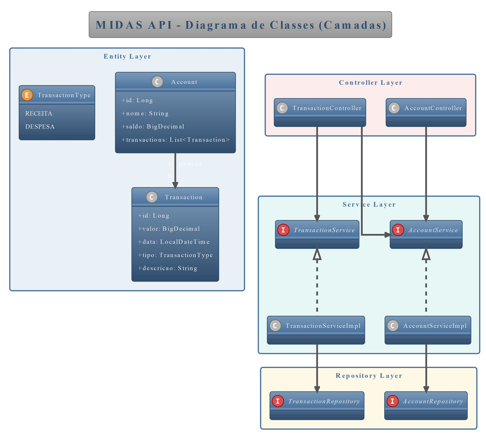

# Midas API - Sistema de Gestão Financeira

API REST desenvolvida em Java com Spring Boot para gestão financeira pessoal, atendendo aos requisitos da Sprint Java Advanced da FIAP.

**🔗 Repositório GitHub:** [midas-fintech repo](https://github.com/viniruggeri/midas-fintech-java)

## 📋 Descrição do Problema

O sistema resolve o problema de controle financeiro pessoal, permitindo:
- Gerenciar contas bancárias
- Registrar e acompanhar transações financeiras
- Controlar receitas e despesas
- Fornecer dados estruturados para análises e relatórios financeiros

## 👥 Equipe

| Nome | Função | RM        | Responsabilidade no Projeto |
|------|--------|-----------|---------------------------|
| **Vinicius** | Tech Lead / IA Engineer | 560593    | Desenvolvimento Java/Spring Boot, Arquitetura da API, Serviços de IA com RAG |
| **Barbara** | Cloud/QA Engineer | RM 560431 | Cloud Azure, QA/Testes, Compliance, Modelagem e Administração de Database |
| **Yasmin** | Mobile/Backend Developer | RM 560039 | Mobile Development, .NET Development, Integração com API |

## 🏗️ Arquitetura da Aplicação

### Camadas da Aplicação:
```
┌─────────────────┐
│   Controller    │ ← REST Controllers (Nível 3 Richardson, HATEOAS)
├─────────────────┤
│    Service      │ ← Regras de Negócio e Validações
├─────────────────┤
│   Repository    │ ← Acesso a Dados (JPA + Generics)
├─────────────────┤
│    Entity       │ ← Entidades JPA Mapeadas
├─────────────────┤
│   Database      │ ← Oracle (Prod) / H2 (Dev)
└─────────────────┘
```

### Padrões de Projeto Utilizados:
- **Repository Pattern** com Generics (JpaRepository<T, ID>)
- **Dependency Injection** (Spring IoC)
- **MVC Pattern** (Model-View-Controller)
- **DTO Pattern** (Data Transfer Objects)

## 🛠️ Tecnologias

- **Java 21** - Linguagem principal
- **Spring Boot 3.2.5** - Framework principal
- **Spring Data JPA** - Persistência de dados e mapeamento objeto-relacional
- **Spring Validation** - Validação funcional com Bean Validation
- **Lombok** - Redução de boilerplate code
- **H2 Database** - Desenvolvimento
- **Oracle Database** - Produção
- **SpringDoc OpenAPI** - Documentação automática da API
- **Maven** - Gerenciamento de dependências
- **JUnit 5 + Mockito** - Testes unitários e de integração

## 📊 Diagramas

### Diagrama Entidade-Relacionamento (DER)


### Diagrama de Classes de Entidade


### Explicação dos Relacionamentos e Constraints:
- **Account (1) ←→ (N) Transaction**: Uma conta pode ter várias transações
- **Constraints Implementadas**: 
  - Account.saldo deve ser >= 0 (@DecimalMin)
  - Account.nome é obrigatório e não pode ser vazio (@NotBlank)
  - Transaction.valor deve ser > 0 (@DecimalMin)
  - Transaction.tipo é obrigatório (RECEITA/DESPESA)
  - Transaction.data é obrigatória (@NotNull)
  - Account.nome deve ser único (validação no service)

## 🚀 Como Executar a Aplicação

### Pré-requisitos:
- Java 21 ou superior
- Maven 3.8+
- Oracle Database (para produção)

### Execução em Desenvolvimento (H2):
```bash
# Clone o repositório
git clone https://github.com/viniruggeri/midas-fintech-java.git
cd midas-fintech-java

# Execute com H2 em memória
.\mvnw.cmd spring-boot:run -Dspring-boot.run.profiles=dev
```

### Execução em Produção (Oracle):
```bash
# Configure as variáveis de ambiente no `.env` 
set ORACLE_URL=jdbc:oracle:thin:@//seu_host:1521/seu_servico
set ORACLE_USER=seu_usuario
set ORACLE_PASSWORD=sua_senha

# Execute com Oracle
.\mvnw.cmd spring-boot:run -Dspring-boot.run.profiles=prod
```

# Execute os endpoints via collection Postman/Insomnia:
- Importe o arquivo `docs/midas-api-collection.json`
- Teste todos os endpoints com exemplos de requisições
- Valide a persistência e recuperação de dados
- Verifique os status codes retornados
- Confira a documentação Swagger para detalhes adicionais
- Ajuste os dados conforme necessário para seus testes

# Ou execute via test-api.http via HTTP Client do IntelliJ (versão paga):
- Importe o arquivo `docs/test-api.http`
- Teste todos os endpoints com exemplos de requisições
- Valide a persistência e recuperação de dados
- Verifique os status codes retornados
- Confira a documentação Swagger para detalhes adicionais
- Ajuste os dados conforme necessário para seus testes
### Acessos:
- **API**: http://localhost:8080/api
- **Swagger UI**: http://localhost:8080/swagger-ui.html
- **H2 Console**: http://localhost:8080/h2-console (dev only)

## 📚 Documentação da API (Swagger/OpenAPI)

### Endpoints Disponíveis:

#### 🏦 **Accounts (Contas)**
- `POST /api/accounts` - Criar conta
- `GET /api/accounts` - Listar todas as contas
- `GET /api/accounts/{id}` - Buscar conta por ID
- `PUT /api/accounts/{id}` - Atualizar conta
- `DELETE /api/accounts/{id}` - Excluir conta

#### 💰 **Transactions (Transações)**
- `POST /api/transactions` - Criar transação
- `GET /api/transactions` - Listar todas as transações
- `GET /api/transactions/{id}` - Buscar transação por ID
- `GET /api/transactions/account/{accountId}` - Transações por conta
- `GET /api/transactions/account/{accountId}/paged` - Transações paginadas
- `PUT /api/transactions/{id}` - Atualizar transação
- `DELETE /api/transactions/{id}` - Excluir transação

**API implementada em conformidade com Richardson Maturity Model - Nível 3 (HATEOAS)**

### Exemplo de resposta HATEOAS (Account)

```json
{
  "id": 1,
  "nome": "Conta Corrente",
  "saldo": 1500.00,
  "_links": {
    "self": { "href": "http://localhost:8080/api/accounts/1" },
    "all-accounts": { "href": "http://localhost:8080/api/accounts" },
    "update": { "href": "http://localhost:8080/api/accounts/1" },
    "delete": { "href": "http://localhost:8080/api/accounts/1" },
    "transactions": { "href": "http://localhost:8080/api/transactions/account/1" }
  }
}
```

Veja mais detalhes em `docs/evolucao-sprint1-sprint2.md`.

## 🧪 Testes da Aplicação

### Suíte de Testes Implementada:
#### **Testes Unitários:**
- `AccountTest` - Validações Bean Validation
- `TransactionTest` - Validações e enums
- `AccountServiceImplTest` - Regras de negócio (Mockito)
- `TransactionServiceImplTest` - Lógica de saldo e validações

#### **Testes de Integração:**
- `AccountRepositoryTest` - Persistência JPA (@DataJpaTest)
- `TransactionRepositoryTest` - Queries e relacionamentos
- `AccountControllerTest` - API REST (@WebMvcTest)
- `TransactionControllerTest` - Endpoints e status codes

### Collection Postman/Insomnia:
- **Arquivo**: `docs/midas-api-collection.json`
- **Conteúdo**: Todos os endpoints com exemplos de requisições
- **Instruções**: Importar no Postman/Insomnia para testar
- **Validação**: Persistência e recuperação de dados testada

### Cenários de Teste Cobertos:
1. **CRUD Completo de Contas**
2. **CRUD Completo de Transações** 
3. **Validações de Negócio**
4. **Relacionamentos entre Entidades**
5. **Persistência e Recuperação de Dados Oracle/H2**

## 📋 Cronograma de Desenvolvimento

| Atividade | Responsável | Prazo | Status |
|-----------|-------------|-------|--------|
| Modelagem de Dados e DER | Barbara | 26/09 - 28/09 | ✅ Concluído |
| Entidades JPA e Mapeamentos | Vinicius | 29/09 - 01/10 | ✅ Concluído |
| Repositories com Generics | Vinicius | 02/10 - 03/10 | ✅ Concluído |
| Services e Regras de Negócio | Vinicius | 04/10 - 05/10 | ✅ Concluído |
| Controllers REST Nível 1 | Vinicius | 06/10 - 07/10 | ✅ Concluído |
| Testes Automatizados | Barbara | 08/10 - 09/10 | ✅ Concluído |
| Documentação e Collection | Barbara | 09/10 - 10/10 | ✅ Concluído |

**Sprint:** 26/09/2025 - 10/10/2025

## 🎥 Vídeos

- Apresentação geral: [apresentação](https://youtu.be/UR1eIVgAwuE)
- Evolução Sprint 2: [evolução sp2](https://youtu.be/IxnOknQVfv8)

Apresentação da Proposta Tecnológica

### Público-alvo

- Pessoas físicas que desejam controlar suas finanças pessoais

### Problemas solucionados

- Controle descentralizado de contas bancárias
- Falta de visibilidade sobre receitas e despesas
- Dificuldade para acompanhar transações financeiras
- Necessidade de dados estruturados para análises

## 📁 Estrutura do Repositório

```text
midas-fintech-java/
├── src/main/java/com/fiap/midasfintech/
│   ├── entity/          # Entidades JPA (Account, Transaction)
│   ├── repository/      # Repositories com Generics
│   ├── service/         # Regras de Negócio e Validações
│   ├── controller/      # REST Controllers
│   ├── dto/            # DTOs Request/Response
│   └── config/         # Configurações (Swagger, Exception Handler)
├── src/main/resources/
│   ├── application.yaml      # Configuração principal
│   ├── application-dev.yaml  # Profile H2
│   ├── application-prod.yaml # Profile Oracle
│   └── data.sql             # Dados iniciais
├── src/test/java/           # Testes unitários e integração
├── docs/
│   ├── cronograma-desenvolvimento.md
│   ├── verificacao-conformidade.md
│   ├── diagrams/       # DER e Diagrama de Classes
│   └── midas-api-collection.json # Collection Postman
└── README.md          # Esta documentação
```

## 📄 Licença

[Midas Fintech - Todos os direitos reservados](LICENSE)

### © 2025 Vinicius, Barbara, Yasmin - Midas Fintech - Todos os direitos reservados
