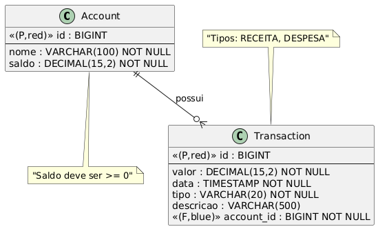
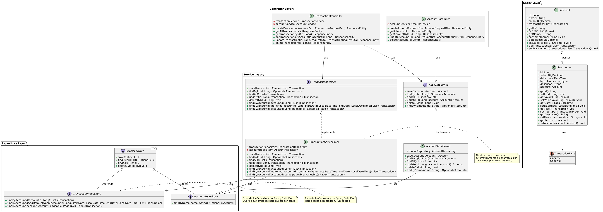

# Midas API - Sistema de Gestão Financeira

API REST desenvolvida em Java com Spring Boot para gestão financeira pessoal, atendendo aos requisitos da Sprint Java Advanced da FIAP.

**🔗 Repositório GitHub:** [midas-fintech repo](https://github.com/viniruggeri/midas-fintech-java)

**📹 Vídeo de Apresentação:** [Link para o vídeo] _(a ser adicionado)_

## 📋 Descrição do Problema

O sistema resolve o problema de controle financeiro pessoal, permitindo:
- Gerenciar contas bancárias
- Registrar e acompanhar transações financeiras
- Controlar receitas e despesas
- Fornecer dados estruturados para análises e relatórios financeiros

## 🎯 Público-Alvo

- Pessoas físicas que desejam controlar suas finanças pessoais
- Pequenos empreendedores que precisam de gestão financeira simplificada
- Usuários que buscam uma solução tecnológica moderna e intuitiva

## 👥 Equipe

| Nome | Função | RM        | Responsabilidade no Projeto |
|------|--------|-----------|---------------------------|
| **Vinicius Ruggeri** | Tech Lead / IA Engineer | 560593    | Desenvolvimento Java/Spring Boot, Arquitetura da API, HATEOAS, Serviços de IA com RAG |
| **Barbara** | Cloud/QA Engineer | RM Barbara | Cloud Azure, QA/Testes, Compliance, Modelagem e Administração de Database |
| **Yasmin** | Mobile/Backend Developer | RM Yasmin | Mobile Development, .NET Development, Integração com API |

## 🏗️ Arquitetura da Aplicação

### Camadas da Aplicação:
```
┌─────────────────┐
│   Controller    │ ← REST Controllers (Nível 3 Richardson - HATEOAS)
├─────────────────┤
│    Service      │ ← Regras de Negócio e Validações
├─────────────────┤
│   Repository    │ ← Acesso a Dados (JPA + Generics)
├─────────────────┤
│    Entity       │ ← Entidades JPA Mapeadas
├─────────────────┤
│   Database      │ ← Oracle (Prod) / H2 (Dev)
└─────────────────┘
```

### Padrões de Projeto Utilizados:
- **Repository Pattern** com Generics (JpaRepository<T, ID>)
- **Dependency Injection** (Spring IoC)
- **MVC Pattern** (Model-View-Controller)
- **DTO Pattern** (Data Transfer Objects)
- **HATEOAS Pattern** (Hypermedia as the Engine of Application State)

## 🛠️ Tecnologias

- **Java 21** - Linguagem principal
- **Spring Boot 3.5.6** - Framework principal
- **Spring Data JPA** - Persistência de dados e mapeamento objeto-relacional
- **Spring HATEOAS** - Implementação de hipermídia (Nível 3 Richardson) **[NOVO Sprint 2]**
- **Spring Validation** - Validação funcional com Bean Validation
- **Lombok** - Redução de boilerplate code
- **H2 Database** - Desenvolvimento
- **Oracle Database** - Produção
- **SpringDoc OpenAPI** - Documentação automática da API
- **Maven** - Gerenciamento de dependências
- **JUnit 5 + Mockito** - Testes unitários e de integração

## 🚀 Evolução Sprint 1 → Sprint 2

### Sprint 1 (Nível 1 Richardson):
- ✅ API REST básica com URIs e verbos HTTP
- ✅ Persistência em Oracle Database
- ✅ Validações funcionais
- ✅ Testes automatizados

### Sprint 2 (Nível 3 Richardson - HATEOAS):
- ✅ **Links hipermídia em todas as respostas**
- ✅ **Navegação autodescritiva entre recursos**
- ✅ **CollectionModel para coleções**
- ✅ **Links bidirecionais entre Account e Transaction**

**📄 Documento detalhado:** [Evolução Sprint 1→2](docs/evolucao-sprint1-sprint2.md)

## 📊 Diagramas

### Diagrama Entidade-Relacionamento (DER)


### Diagrama de Classes de Entidade


### Explicação dos Relacionamentos e Constraints:
- **Account (1) ←→ (N) Transaction**: Uma conta pode ter várias transações
- **Constraints Implementadas**: 
  - Account.saldo deve ser >= 0 (@DecimalMin)
  - Account.nome é obrigatório e não pode ser vazio (@NotBlank)
  - Transaction.valor deve ser > 0 (@DecimalMin)
  - Transaction.tipo é obrigatório (RECEITA/DESPESA)
  - Transaction.data é obrigatória (@NotNull)
  - Account.nome deve ser único (validação no service)

## 🚀 Como Executar a Aplicação

### Pré-requisitos:
- Java 21 ou superior
- Maven 3.8+
- Oracle Database (para produção)

### Execução em Desenvolvimento (H2):
```bash
# Clone o repositório
git clone https://github.com/viniruggeri/midas-fintech-java.git
cd midas-fintech-java

# Execute com H2 em memória
.\mvnw.cmd spring-boot:run -Dspring-boot.run.profiles=dev
```

### Execução em Produção (Oracle):
```bash
# Configure as variáveis de ambiente
set ORACLE_URL=jdbc:oracle:thin:@//seu_host:1521/seu_servico
set ORACLE_USER=seu_usuario
set ORACLE_PASSWORD=sua_senha

# Execute com Oracle
.\mvnw.cmd spring-boot:run -Dspring-boot.run.profiles=prod
```

A aplicação estará disponível em: **http://localhost:8080**

## 📚 Documentação da API

### Swagger UI (OpenAPI):
Acesse: **http://localhost:8080/swagger-ui/index.html**

### Endpoints Principais:

#### 🏦 Contas (Accounts)
| Método | Endpoint | Descrição |
|--------|----------|-----------|
| GET | `/api/accounts` | Lista todas as contas (com links HATEOAS) |
| GET | `/api/accounts/{id}` | Busca uma conta por ID (com links HATEOAS) |
| POST | `/api/accounts` | Cria uma nova conta |
| PUT | `/api/accounts/{id}` | Atualiza uma conta existente |
| DELETE | `/api/accounts/{id}` | Remove uma conta |

#### 💰 Transações (Transactions)
| Método | Endpoint | Descrição |
|--------|----------|-----------|
| GET | `/api/transactions` | Lista todas as transações (com links HATEOAS) |
| GET | `/api/transactions/{id}` | Busca uma transação por ID (com links HATEOAS) |
| GET | `/api/transactions/account/{accountId}` | Lista transações de uma conta |
| GET | `/api/transactions/account/{accountId}/paged` | Lista transações paginadas |
| POST | `/api/transactions` | Cria uma nova transação |
| PUT | `/api/transactions/{id}` | Atualiza uma transação |
| DELETE | `/api/transactions/{id}` | Remove uma transação |

### Exemplo de Resposta HATEOAS (Sprint 2):

```json
{
  "id": 1,
  "nome": "Conta Corrente",
  "saldo": 1500.00,
  "_links": {
    "self": {
      "href": "http://localhost:8080/api/accounts/1"
    },
    "all-accounts": {
      "href": "http://localhost:8080/api/accounts"
    },
    "update": {
      "href": "http://localhost:8080/api/accounts/1"
    },
    "delete": {
      "href": "http://localhost:8080/api/accounts/1"
    },
    "transactions": {
      "href": "http://localhost:8080/api/transactions/account/1"
    }
  }
}
```

## 🧪 Testes

### Executar Testes:
```bash
.\mvnw.cmd test
```

### Collection Postman:
Importe o arquivo: **[docs/midas-api-collection.json](docs/midas-api-collection.json)**

### HTTP Client (IntelliJ):
Use o arquivo: **[docs/test-api.http](docs/test-api.http)**

## 📁 Estrutura do Projeto

```
src/main/java/com/fiap/midasfintech/
├── config/          # Configurações (Swagger, Handlers, Inicialização)
├── controller/      # Controllers REST com HATEOAS
├── dto/             # DTOs de Request e Response
├── entity/          # Entidades JPA
├── repository/      # Repositories com JpaRepository
└── service/         # Services com lógica de negócio
```

## 📖 Documentação Adicional

- **[Cronograma de Desenvolvimento](docs/cronograma-desenvolvimento.md)** - Planejamento Sprint 1 e 2
- **[Evolução Sprint 1→2](docs/evolucao-sprint1-sprint2.md)** - Detalhamento das melhorias
- **[Diagramas](docs/diagrams/)** - DER e Diagrama de Classes

## 🔐 Licença

Este projeto é proprietário e de uso restrito:
- Uso permitido apenas para membros da equipe (Vinicius, Barbara, Yasmin)
- Uso permitido para avaliação pela FIAP (professores)
- Proibida distribuição, modificação ou uso comercial sem autorização

## 📞 Contato

Para dúvidas ou mais informações, entre em contato com a equipe através do repositório GitHub.

---

**Versão:** 2.0.0 (Sprint 2)  
**Data:** 02/11/2025  
**Status:** ✅ Pronto para Produção
