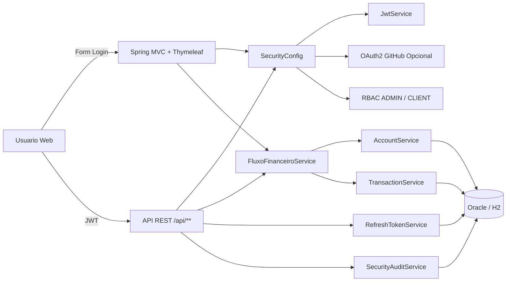
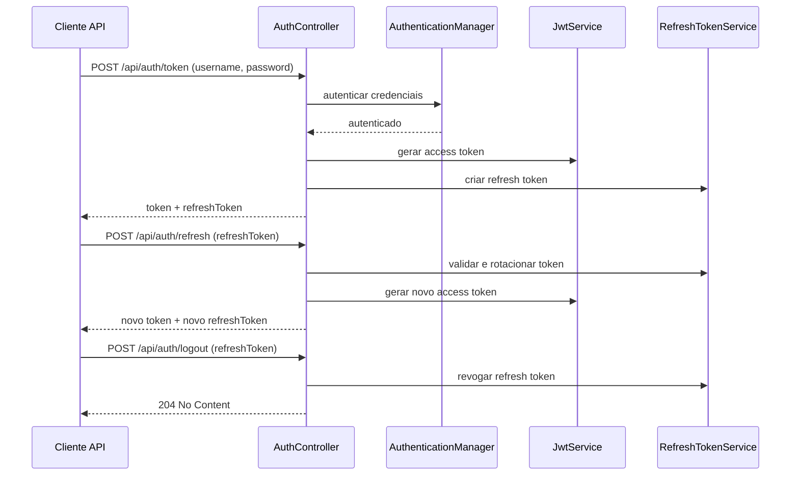
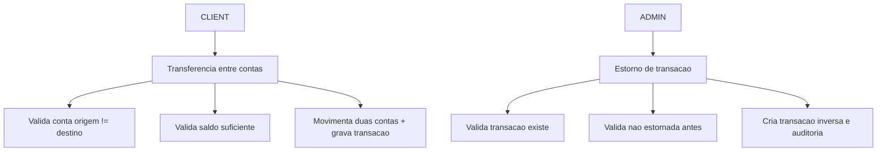

# Arquitetura CP1 - Segurança e Fluxos

## Visão de Componentes

```mermaid
flowchart LR
    U[Usuario Web] -->|Form Login| W[Spring MVC + Thymeleaf]
    U -->|JWT| A[API REST /api/**]

    W --> S[SecurityConfig]
    A --> S

    S --> J[JwtService]
    S --> O[OAuth2 GitHub Opcional]
    S --> R[RBAC ADMIN / CLIENT]

    A --> F[FluxoFinanceiroService]
    W --> F

    F --> AC[AccountService]
    F --> TR[TransactionService]
    A --> RT[RefreshTokenService]
    A --> AU[SecurityAuditService]

    AC --> DB[(Oracle / H2)]
    TR --> DB
    RT --> DB
    AU --> DB
```

## Fluxo de Autenticação da API

```mermaid
sequenceDiagram
    participant C as Cliente API
    participant Auth as AuthController
    participant AM as AuthenticationManager
    participant JWT as JwtService
    participant RT as RefreshTokenService

    C->>Auth: POST /api/auth/token (username, password)
    Auth->>AM: autenticar credenciais
    AM-->>Auth: autenticado
    Auth->>JWT: gerar access token
    Auth->>RT: criar refresh token
    Auth-->>C: token + refreshToken

    C->>Auth: POST /api/auth/refresh (refreshToken)
    Auth->>RT: validar e rotacionar token
    Auth->>JWT: gerar novo access token
    Auth-->>C: novo token + novo refreshToken

    C->>Auth: POST /api/auth/logout (refreshToken)
    Auth->>RT: revogar refresh token
    Auth-->>C: 204 No Content
```

## Fluxos Funcionais FIAP

```mermaid
flowchart TD
    CL[CLIENT] --> T1[Transferencia entre contas]
    T1 --> V1[Valida conta origem != destino]
    T1 --> V2[Valida saldo suficiente]
    T1 --> M1[Movimenta duas contas + grava transacao]

    AD[ADMIN] --> E1[Estorno de transacao]
    E1 --> V3[Valida transacao existe]
    E1 --> V4[Valida nao estornada antes]
    E1 --> M2[Cria transacao inversa e auditoria]
```
