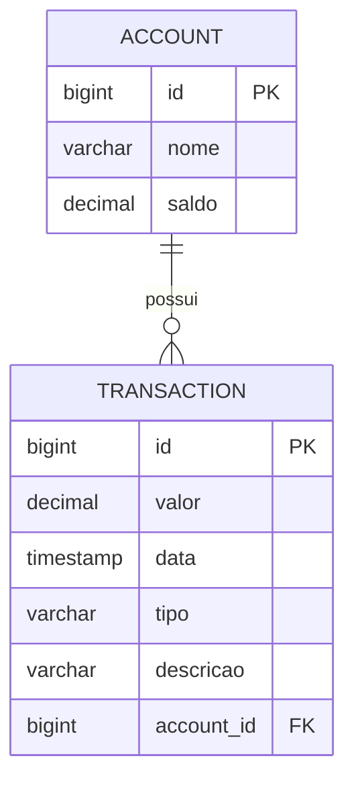

```mermaid
erDiagram
    ACCOUNT {
        bigint id PK
        varchar nome
        decimal saldo
    }
    
    TRANSACTION {
        bigint id PK
        decimal valor
        timestamp data
        varchar tipo
        varchar descricao
        bigint account_id FK
    }
    
    ACCOUNT ||--o{ TRANSACTION : "possui"
```
